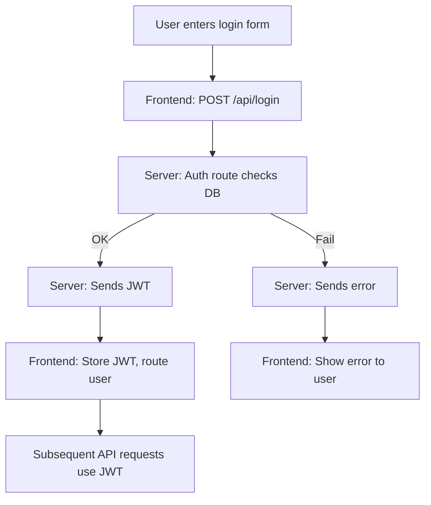

# 🚀 What Is Dev-Elevate? (Mission & Vision)

Dev-Elevate is an open-source, full-stack platform designed to boost your developer journey—whether you want to learn, collaborate, build your portfolio, or land a job. It combines a real-world project structure (modern frontend + backend) with contributor-first documentation to help you **understand, not just install**.

---

## 📖 Table of Contents

1. [Why Dev-Elevate?](#1-why-dev-elevate-pain-points-it-solves)
2. [High-Level System Map](#2-high-level-system-map)
3. [Folder Structure (What & Why)](#3-folder-structure-what--why)
4. [Architectural Deep Dive (How Everything Connects)](#4-architectural-deep-dive-how-everything-connects)
5. [Core Features Explained (With Flowcharts)](#5-core-features-explained-with-flowcharts)
6. [Frontend: The Client App](#6-frontend-the-client-app)
7. [Backend: The Server API](#7-backend-the-server-api)
8. [How to Run and Actually Debug This Project](#8-how-to-run-and-actually-debug-this-project)
9. [Common Workflows (What a Real Contributor Does)](#9-common-workflows-what-a-real-contributor-does)
10. [Best Practices, Gotchas, & Style Guide](#10-best-practices-gotchas--style-guide)
11. [Learning Path: “Level Up From 0 ➔ Contributor”](#11-learning-path-level-up-from-0--contributor)
12. [Contributor Quick Wins](#12-contributor-quick-wins)
13. [How to Get Your PR Reviewed Fast](#13-how-to-get-your-pr-reviewed-fast)
14. [FAQ, Troubleshooting & Community Help](#14-faq-troubleshooting--community-help)
15. [Learning Resources & Further Reading](#15-learning-resources--further-reading)

---

## 1. Why Dev-Elevate? (Pain Points It Solves)

* **For New Devs:** Hands-on, resume-ready project. Practice real PRs, code reviews, and deployments.
* **For Contributors:** Friendly onboarding. Clear structure, starter issues, clean documentation.
* **For Maintainers:** Scalable contributor experience, less hand-holding, better community health.
* **For Everyone:** Modern stack (React, TypeScript, Node, Tailwind, Express, JWT), with “learn as you build” philosophy.

---

## 2. High-Level System Map

```
Root/
├── .github/           # GitHub templates (PRs, issues)
├── .project-docs/     # Meta docs: FAQ, INSTALL, ROADMAP, etc.
├── DevElevate/
│   ├── Client/        # Frontend app (React/TS/Tailwind)
│   └── Server/        # Backend API (Node/Express)
├── [Meta files: README, LICENSE, CODE_OF_CONDUCT...]
```

* **Mono-repo:** Both Client and Server together for easy collaboration
* **Docs-first:** `.project-docs` offers extra, non-code docs

---

## 3. Folder Structure (What & Why)

**Top-level:**

* `.github/` → Issue/PR templates (contributing standards)
* `.project-docs/` → Extra docs for project meta, not always present in OSS
* `DevElevate/Client/` → All frontend logic, assets, configs
* `DevElevate/Server/` → All backend logic, API, configs
* `README.md` → Project intro, quickstart
* `CONTRIBUTING.md` → Step-by-step for new contributors
* `LICENSE`, `CODE_OF_CONDUCT.md`, etc. → Legal & community norms

**Pro tip:** If you’re lost, start with `README.md` and peep `.project-docs/INSTALL.md`.

---

## 4. Architectural Deep Dive (How Everything Connects)

* **Frontend (`Client/`):** React (with Vite for speed), written in TypeScript, styled using Tailwind. Handles all UI, routing, and makes API calls to backend.
* **Backend (`Server/`):** Node.js with Express. All REST APIs, authentication (likely JWT), and business logic.
* **Shared contract:** Environment variables and documented endpoints.

**Data flow example:**

1. User logs in (Client sends POST to Server `/api/login`)
2. Server validates, sends back JWT token
3. Client stores JWT (in memory or localStorage)
4. Client uses JWT for future requests (protected endpoints)

**Deployment:** Designed for cloud (e.g., Vercel/Render/Heroku for client/server split)

---

## 5. Core Features Explained (With Flowcharts)

**User Authentication Flow:**



**Other Features:**

* Dashboard: User-specific data pulled from backend
* “Practice/Job” modules: Not explicit in code tree, but likely features based on project theme
* Error handling: Server sends status codes, client parses and displays feedback

**See code:** For full flow, check `DevElevate/Client/` components and `DevElevate/Server/index.js` routes.

---

## 6. Frontend: The Client App

* **Stack:** React + TypeScript + Vite + Tailwind CSS
* **Configs:** `vite.config.ts`, `tailwind.config.js`, `tsconfig.json`, `.env.local`
* **Main files:** Components, pages, hooks (see `src/`)
* **Dev workflow:**

  * `npm install`
  * `npm run dev`
* **Hot reload & instant feedback**

**Debug tip:** Start with `index.html` (entry), then follow routing in main component tree.

---

## 7. Backend: The Server API

* **Stack:** Node.js + Express
* **Configs:** `.env.sample`, `package.json`, scripts
* **Main file:** `index.js` (API entry point)
* **Common scripts:** `test-jwt.js`, `create-test-logs.js`
* **RESTful design:** All logic in `/api/` endpoints

**Auth/Protected routes:** Look for JWT middleware in routes (often called `auth.js` or directly in route code)

**Debug tip:** Use Postman or curl to hit endpoints locally—read error messages, check console output in server.

---

## 8. How to Run and Actually Debug This Project

**A. Running Locally:**

* Clone repo
* Install deps in both `Client` and `Server`
* Copy `.env.sample` in Server to `.env` (add secrets, DB string)
* `cd Client && npm run dev` (usually [http://localhost:5173](http://localhost:5173))
* `cd ../Server && npm run dev` (usually [http://localhost:5000](http://localhost:5000))

**B. Debugging:**

* Check browser dev tools (Network tab) for failed requests
* Look at Server logs for errors (console output)
* Use breakpoints in VSCode (Node debugging, Chrome for React)
* Inspect `.env` for typos or missing values

**C. Pro tip:** Change code, see instant effect thanks to Vite/hot reload.

---

## 9. Common Workflows (What a Real Contributor Does)

1. **Explore:** Read `README.md`, this `LEARN.md`, and `CONTRIBUTING.md`
2. **Clone & Setup:** Fork, clone, install, run both servers
3. **Pick an Issue:** See GitHub Issues (look for labels: `good first issue`, `documentation`, `bug`)
4. **Make a Branch:** Never PR to main; always branch off
5. **Code & Test:** Small commits, self-review before PR
6. **Push & PR:** Clear title, reference any related issues
7. **Respond to Reviews:** Open, friendly, and ready to learn

---

## 10. Best Practices, Gotchas, & Style Guide

* **Use TypeScript where possible** (type-safety = fewer bugs)
* **Commit messages:** Be concise but clear (`fix:`, `feat:`, `docs:`, etc.)
* **Follow PR template:** The more info, the better
* **.env safety:** Never commit secrets or real env files
* **Lint/format:** Use ESLint + Prettier (check for configs in Client)
* **Consistent naming:** Functions, files, and branches (see existing code)
* **DRY:** Don’t Repeat Yourself—reuse components & utilities
* **Read error messages fully:** 90% of issues are fixable with careful reading

---

## 11. Learning Path: “Level Up From 0 ➔ Contributor”

**Beginner:**

* Clone, install, and run both servers
* Change a doc, style, or small UI bug
* Open a doc PR (test the workflow)

**Intermediate:**

* Trace a user flow (login, dashboard)
* Fix a frontend bug or small backend endpoint
* Add/modify a small component or route

**Advanced:**

* Refactor code for readability or performance
* Add tests (unit/integration)
* Propose or build a new feature

---

## 12. Contributor Quick Wins

* **Update or improve docs** (spotted a typo or unclear step? Fix it!)
* **Add comments to tricky code** (especially if you just learned something useful)
* **Fix a UI issue or bug** in `Client/`
* **Write a new test case** for a backend route
* **Suggest/implement accessibility improvements** (ARIA, color contrast, tab order)
* **Add or improve error handling** (user feedback or logging)
* **Clean up linter/prettier warnings**

---

## 13. How to Get Your PR Reviewed Fast

* Reference the related issue in your PR title/body (e.g., “Fixes #123”)
* Fill out the PR template fully (screenshots help if UI is involved)
* Keep changes focused—avoid mega-PRs
* Ask clear questions in your PR if you’re unsure about any approach
* Be responsive to reviewer comments—iterate fast and communicate

---

## 14. FAQ, Troubleshooting & Community Help

**I broke something!**

* Roll back latest changes, restart both servers, check `.env` values

**Dependencies not installing?**

* Use Node 18+, clean npm cache, delete node\_modules & reinstall

**Can’t find where a bug is?**

* Start at the UI, trace the request to the backend, check logs and error responses

**How do I get help or feedback?**

* Open an Issue, tag `@maintainers`, or ask in Discussions/Discord if available

---

## 15. 📖 Learning Resources & Further Reading

**Modern Web Dev & Stack (Official):**

* [React Docs](https://react.dev/)
* [TypeScript Docs](https://www.typescriptlang.org/docs/)
* [Node.js Docs](https://nodejs.org/en/docs/)
* [Express Guide](https://expressjs.com/en/starter/installing.html)
* [Vite Guide](https://vitejs.dev/guide/)
* [Tailwind CSS Docs](https://tailwindcss.com/docs/installation)
* [JWT.io Intro](https://jwt.io/introduction/)

**Contributing to Open Source:**

* [GitHub’s Open Source Guides](https://opensource.guide/)
* [How to Write a Good Commit Message](https://www.conventionalcommits.org/en/v1.0.0/)
* [First Contributions: Step by Step](https://firstcontributions.github.io/)

**Debugging & Best Practices:**

* [Chrome DevTools Docs](https://developer.chrome.com/docs/devtools/)
* [Node.js Debugging in VSCode](https://code.visualstudio.com/docs/nodejs/nodejs-debugging)
* [Effective Pull Requests](https://github.blog/2015-01-21-how-to-write-the-perfect-pull-request/)

**Community & Help:**

* [Stack Overflow: React](https://stackoverflow.com/questions/tagged/reactjs)
* [Stack Overflow: Node.js](https://stackoverflow.com/questions/tagged/node.js)
* [Dev.to Community](https://dev.to/)

**Want More?**

- Curious about what’s coming next? See our [ROADMAP](./.project-docs/ROADMAP.md) for planned features and improvements.
- For a list of common errors and fixes, check our [FAQ](./.project-docs/FAQ.md).
- For the most up-to-date installation and setup instructions (including troubleshooting), see [INSTALL](./.project-docs/INSTALL.md).

---


## 🎉 You Made It!

This `LEARN.md` is your map, your cheat sheet, and your *invitation* to start contributing for real.

* Read, experiment, break, fix, and PR!
* Every contribution helps the project—and levels up your skills
* Welcome to the Dev-Elevate community 🚀
